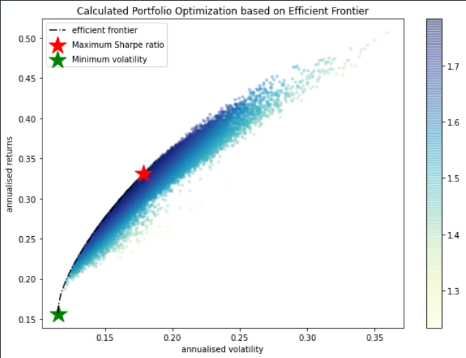

## Efficient Frontier Portfolio Optimization

This code pulls data from yahoo finance in order to calculate an efficient frontier from selected stocks. 
Your output will show both simulated and expected allocations for a Maximum Sharpe Ratio portfolio as well as a minimum volatility portfolio. 

## Quick Start

Simply choose your stock tickers and insert into the tickers list at the beginning of the code. Double check that you have properly installed all requirements.

## Efficient Frontier


## Requirements
Run these codes in your terminal to ensure all requirements are satisfied.
```
pip install pandas
pip install numpy
pip install matplotlib
pip install scipy 
pip install yfinance
```

## References
Check out these great resources that made this project possible below. 

Wrapper for yFinance
https://github.com/ranaroussi/yfinance

Portfolio Optimization Using Python
https://www.linkedin.com/pulse/efficient-frontier-portfolio-optimisation-inpython-ricky-kim


